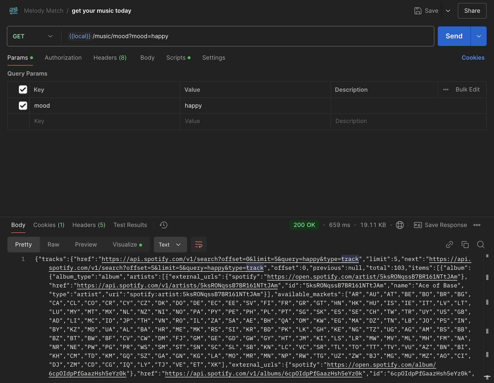
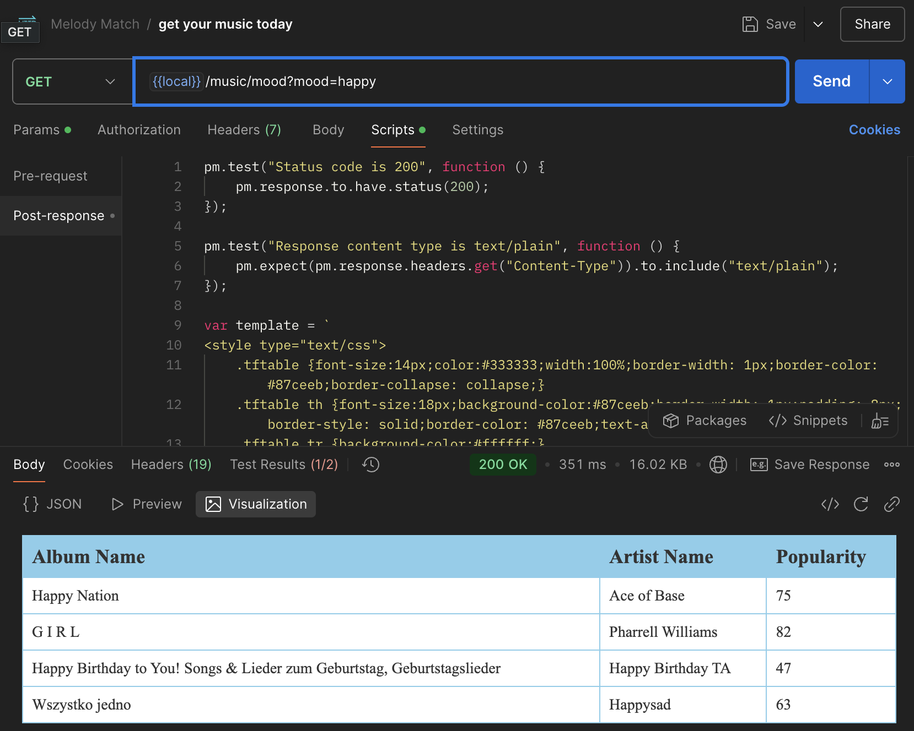
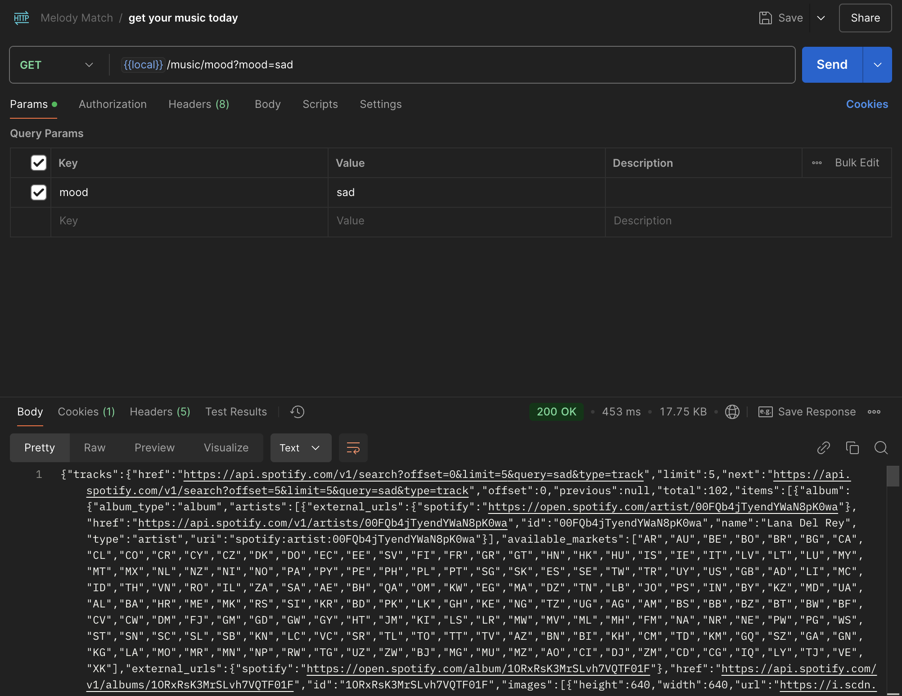
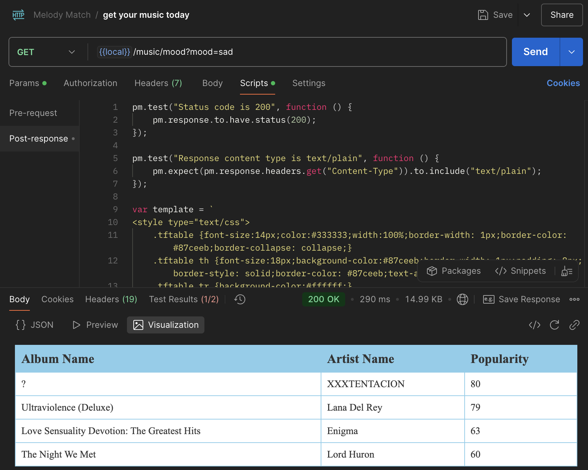
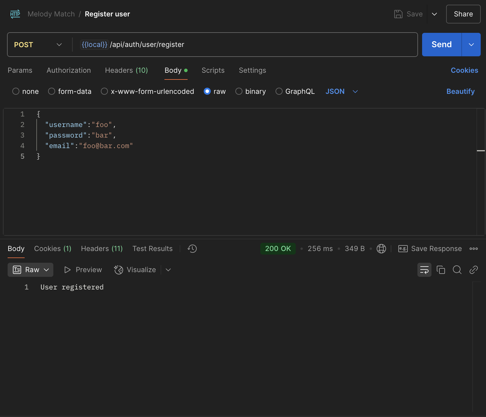
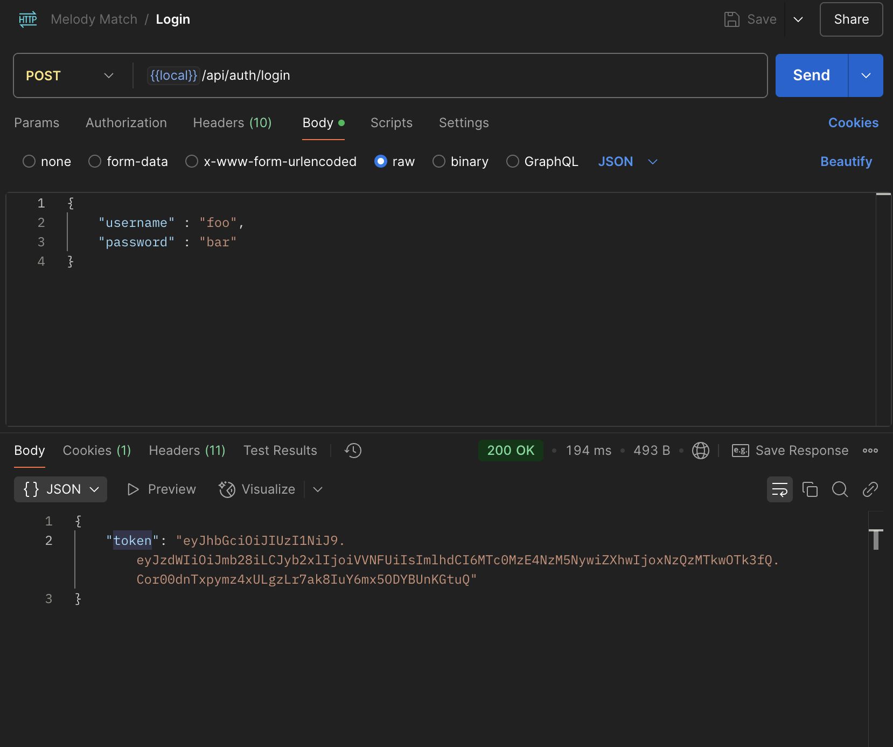
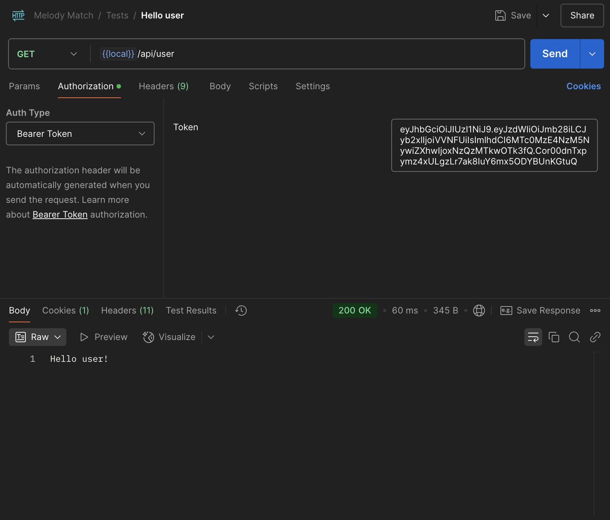
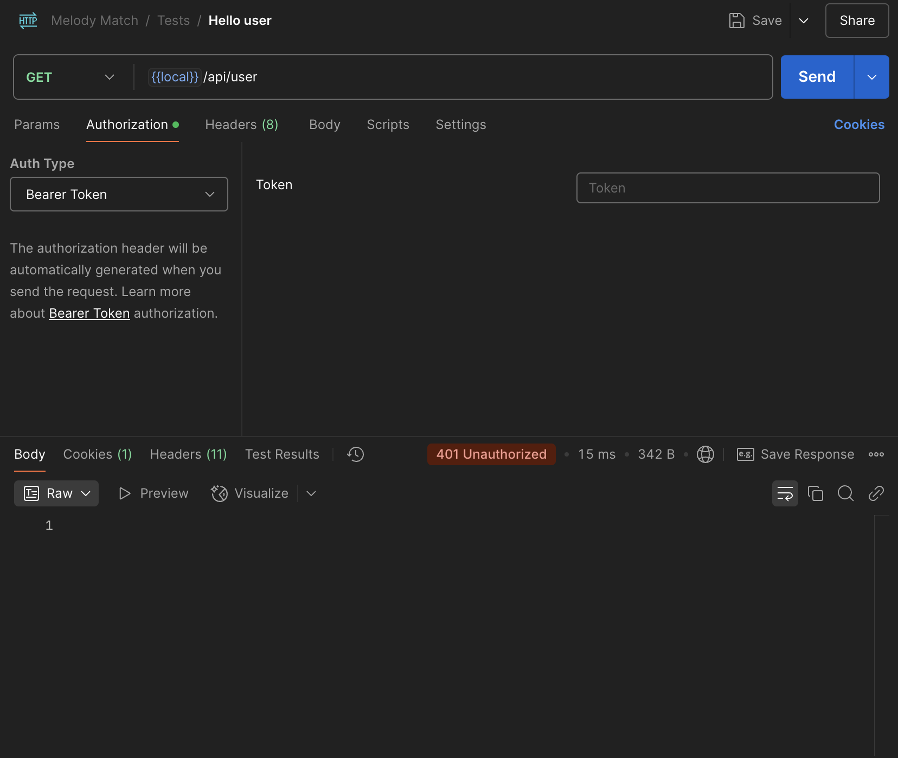

## :bookmark_tabs: About This Project

MelodyMatch is an application that fetches 5 songs from the Spotify API based on the user's mood. By providing a mood query, the app returns a playlist tailored to fit the emotional tone, using the power of Spotify's vast music library to match the requested mood.

## :hammer_and_wrench: Used Technologies

* Java
* Spring Boot
* Spring Data JPA / Hibernate
* MySql
* Maven
* Lombok

## :camera: Screenshots

Happy json response      |  Happy json response (pretty)
:------------------------:|:-------------------------:
  |  

Sad json response      |  Sad json response (pretty)
:------------------------:|:-------------------------:
  |  

Register user      |  Login
:------------------------:|:-------------------------:
  |  

Login success      |  Login failed
:------------------------:|:-------------------------:
  |  

:memo: TODO

* Optimize song fetching based on more mood parameters.
*  Add support for saving and managing favorite songs.
*   Add user authentication for personalized playlists.
