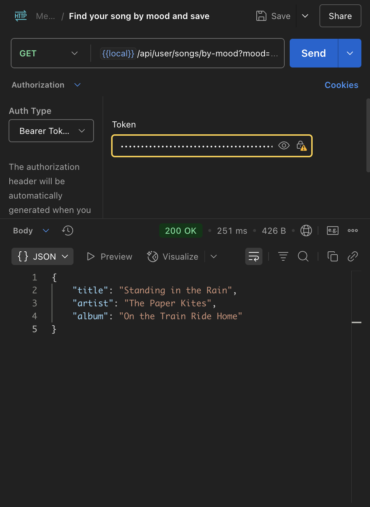
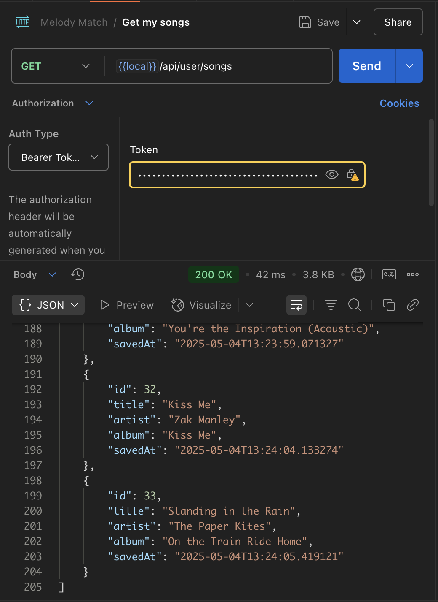
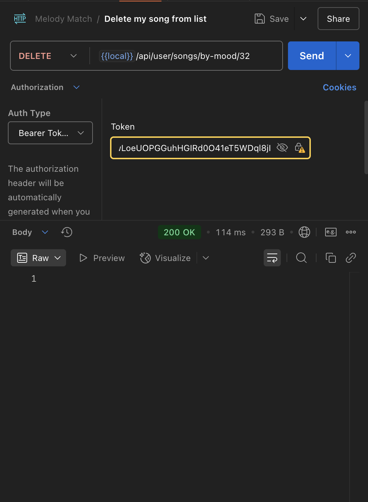
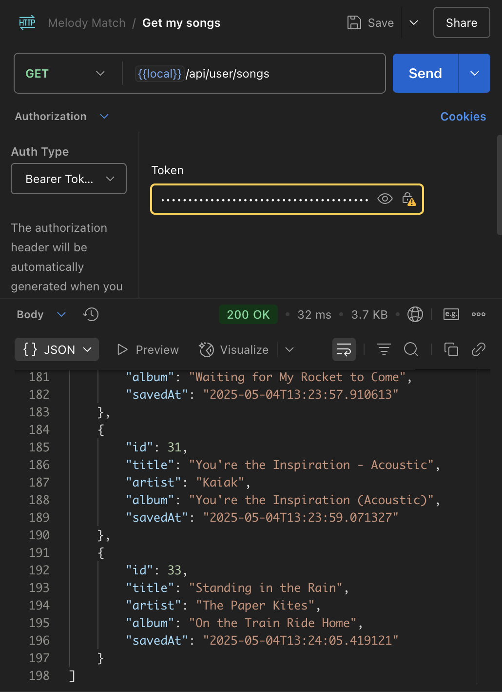

## :bookmark_tabs: About This Project

Melody Match is an application that fetches 4 songs from the Spotify API based on the user's mood. By providing a mood query, the app returns a playlist tailored to fit the emotional tone, using the power of Spotify's vast music library to match the requested mood.

## :hammer_and_wrench: Used Technologies

* Java 17
* Spring Boot 3.4
* Spring Data JPA / Hibernate
* Spring Security (JWT, role-based authentication)
* WebClient
* MySQL
* Lombok
* Maven

## :camera: Screenshots

Happy json response (Unregistered)     |  Happy json response (Unregistered) (pretty)
:------------------------:|:-------------------------:
  |  

Sad json response (Unregistered)     |  Sad json response (Unregistered) (pretty)
:------------------------:|:-------------------------:
  |  

Register user      |  Login
:------------------------:|:-------------------------:
  |  

Login success      |  Login failed
:------------------------:|:-------------------------:
  |  

Find your song by your mood and save it to your account      |  Saved songs
:------------------------:|:-------------------------:
  |  

Delete song from your list      |  List of songs after deleting
:------------------------:|:-------------------------:
  |  

